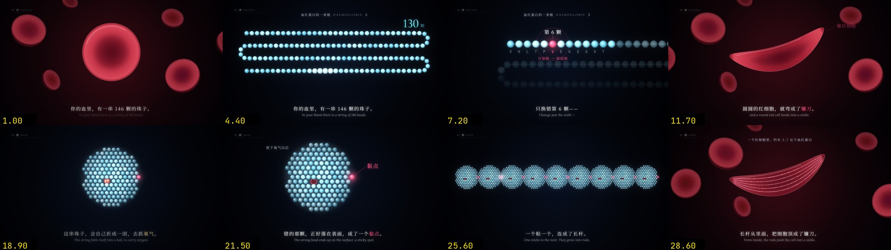
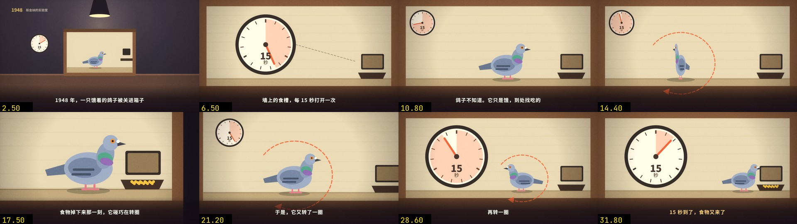

# vibe-knowledge-film

没有旁白的知识短片 skill。16:9，底部字幕，屏上把字幕里说的事演出来：说到什么就画什么，画得像它本身。全片由 Canvas 逐帧画出，再用 Playwright 截图、ffmpeg 合成。

给人用的说明在这里。交给 Agent 的流程在 `SKILL.md`。

## 安装

把这个目录放到 Agent 的 skill 目录，文件夹名保持 `vibe-knowledge-film`。Claude Code 的常见位置是 `~/.claude/skills/vibe-knowledge-film`。

依赖：

```bash
pip install -r requirements.txt
python -m playwright install
```

另外需要本机已经安装的 **Google Chrome** 和 **ffmpeg**。渲染脚本打开的是本机 Chrome，只装 Playwright 自带的 Chromium 不够。

第一次使用先下字体（SIL Open Font License，不放进仓库）：

```bash
python engine/get_fonts.py
```

## 做一条新片

在你自己的项目里建工程，不要建在这个 skill 目录里。

```bash
python scripts/new_film.py <工程目录> --world C
python engine/render.py <工程目录> --serve
```

`--world` 可以是 `C`（夜曲）或 `B`（寓言）。建出来的 `film.js` 只是能跑起来的骨架，里面没有画面：文案不同，屏上的东西就不同，每一镜都按自己的分镜表现写。命令和写法见 `references/engine.md`。

## 样片

自己的题目两段，在 `examples/`。新片不要搬这里的画面。每段怎么做的，见 `examples/README.md`。

预览：

```bash
python engine/render.py examples/fold_C --serve
python engine/render.py examples/pigeon_B --serve
```

### 《折叠》`fold_C`

C 夜曲，开头 33 秒。血红蛋白错一颗氨基酸，红细胞弯成镰刀。分镜表在 `examples/fold_C/storyboard.md`。



### 《鸽子的迷信》`pigeon_B`

B 寓言，开头 33 秒。斯金纳 1948 年的实验：食物按时间掉下来，鸽子碰巧在转圈，于是接着转。分镜表在 `examples/pigeon_B/storyboard.md`。



## 许可

引擎、脚本和文档里的方法说明使用 MIT 许可，见 `LICENSE`。

`references/analysis.md`、`references/prompts.md` 里按成片填好的 brief，以及 `examples/stim_B`、`info_C`，字幕和画面设计来自他人的短片，版权属于原作者。这两段是学习对照，不是可以当作自己作品发布的成片。`examples/fold_C` 和 `examples/pigeon_B` 是自己题目的样片，用来看一张分镜表怎么变成画面；它们不是模板，新片不要搬它们的画面。

上传前可以把 `LICENSE` 开头的版权行改成你的名字。
